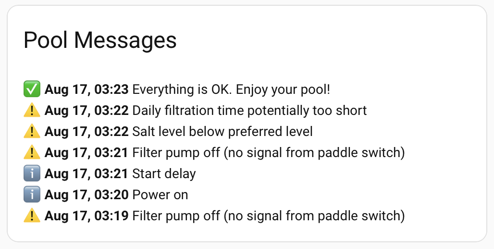

[](https://github.com/hacs/integration) 
 
 [](https://github.com/0xQuantumHome/bayrol-home-hassistant/releases)


# Bayrol Pool Access Integration for Home Assistant

This custom integration allows you to monitor your Bayrol Pool Access device in Home Assistant. It uses a direct MQTT connection to the Bayrol Cloud.

> [!WARNING]
> **Do not modify the integration files locally.** Since v0.9.0 HACS installs
> the integration from a release ZIP, which completely replaces the
> `custom_components/bayrol` folder on every update. Any local changes (e.g.
> manually added datapoints in `const.py`) are lost without warning. If you
> are missing a sensor or setting, please
> [open an issue](https://github.com/0xQuantumHome/bayrol-home-hassistant/issues)
> instead. Known datapoints are usually quick to add officially.

## Features

- Water values (pH, redox, chlorine, salt, temperatures), electrolysis and
  dosing details, canister levels, pump and output states, flow and cover
  states, and connectivity diagnostics (WiFi, web portal, Control Module):

  | Device | Entities |
  | --- | --- |
  | Automatic SALT | 74 |
  | Automatic Cl-pH | 65 |
  | Pool Manager 5 Chlorine | 87 |
- Native entity types: read-only values as `sensor` and `binary_sensor`, the
  pool cover as a read-only `cover`, and writable settings as `select`
  (discrete modes), `number` (targets, alarm limits, temperature setpoints)
  and `switch` (pH dosing, salt electrolysis) entities
- Device messages decoded to readable text in six languages (EN, DE, FR, ES,
  IT, PL), with a message event entity for a full logbook history and a
  `bayrol_message` bus event for automations
- Real-time updates via MQTT connection to the Bayrol cloud

## Tested Devices

- Bayrol Automatic Salt 5 (AS5) and Salt 7 (AS7)
- Bayrol Automatic Cl-pH
- Pool Manager 5 Chlorine

## Supported Entities

The entities you get depend on the device type you select when adding the integration.
The **MQTT ID** is the topic suffix the device publishes under (see [MQTT Debug](#mqtt-debug)), the **Type** is the Home Assistant platform the entity is created on:

- `sensor` – read only
- `binary_sensor` – read-only two-state input
- `cover` – read-only pool-cover state (no controls are exposed)
- `select` – writable, pick one of a fixed list of values
- `number` – writable numeric value
- `switch` – writable on/off setting
- `button` – sends a command to the device

The tables below list the entities the integration creates. A community
reference of **all** known MQTT datapoints, including those not implemented
yet, lives in [docs/DATAPOINTS.md](docs/DATAPOINTS.md), useful if you like to
explore the topics with MQTT Explorer (see [MQTT Debug](#mqtt-debug)) or want
to request a new entity.

### Automatic SALT

| MQTT ID | Name | Type | Unit |
| --- | --- | --- | --- |
| `4.2` | pH Target | number | — |
| `4.3` | pH Alert Max | number | — |
| `4.4` | pH Alert Min | number | — |
| `4.5` | pH Dosing Control Time Interval | sensor | min |
| `4.7` | Minutes Counter / Reset every hour | sensor | min |
| `4.10` | Pool Volume ⁴ | number | m³ |
| `4.26` | Redox Alert Max | number | mV |
| `4.27` | Redox Alert Min | number | mV |
| `4.28` | Redox Target | number | mV |
| `4.34` | Minimal Approach to Control the pH | sensor | — |
| `4.37` | Start Delay | number | min |
| `4.38` | pH Dosing Cycle | sensor | s |
| `4.47` | pH Dosing Speed | sensor | % |
| `4.51` | Polarity Reversal Times | sensor | min |
| `4.66` | Minimum Redox Produktion | number | % |
| `4.67` | SW Version | sensor | — |
| `4.68` | SW Date | sensor | — |
| `4.69` | Hourly Counter / Reset every 24h | sensor | h |
| `4.82` | Redox | sensor | mV |
| `4.89` | pH Dosing Rate | sensor | % |
| `4.91` | Electrolyzer Production Rate | sensor | % |
| `4.92` | Start Delay Remaining | sensor | min |
| `4.98` | Temperature | sensor | °C |
| `4.100` | Salt | sensor | g/l |
| `4.102` | Conductivity | sensor | mS/cm |
| `4.104` | Electrolyzer Voltage | sensor | V |
| `4.105` | Electrolyzer Current | sensor | A |
| `4.106` | Cell Power | sensor | W |
| `4.107` | Battery Voltage | sensor | V |
| `4.112` | Time Before Next Polarity Reversal | sensor | s |
| `4.119` | Time Since Polarity Reversal | sensor | s |
| `4.138` | Salt To Add | sensor | kg |
| `4.144` | Salt Preferred Level | number | g/l |
| `4.145` | Recommended Min Daily Filtration Time | sensor | h |
| `4.146` | Proposed Production Rate | sensor | % |
| `4.147` | Estimated Daily Production | sensor | mg/l |
| `4.176` | Power On Time | sensor | min |
| `4.182` | pH | sensor | — |
| `4.212` | Message Count | sensor | — |
| `4.239` | WiFi RSSI | sensor | dBm |
| `4.304` | Control Module Signal Strength | sensor | % |
| `4.340` | pH Dosing Time Today ³ | sensor | s |
| `4.341` | pH Daily Dosing Limit ³ | number | L |
| `4.343` | pH Dosed Today ³ | sensor | L |
| `5.2` | Language | sensor | — |
| `5.3` | pH Production Rate | select | — |
| `5.9` | Alarm Sound | sensor | — |
| `5.17` | SE Polarity | sensor | — |
| `5.29` | Flow Pump Status | sensor | — |
| `5.37` | Gas Sensor | binary_sensor | — |
| `5.40` | Salt electrolysis ON/OFF | switch | — |
| `5.41` | Redox Mode | select | — |
| `5.42` | pH Dosing ON/OFF | switch | — |
| `5.59` | pH Pause Runtime | sensor | — |
| `5.60` | SE Pause Runtime | sensor | — |
| `5.80` | pH Minus Canister Status | sensor | — |
| `5.83` | Cover | cover | — |
| `5.98` | Flow Contact | binary_sensor | — |
| `5.147` | HW Version | sensor | — |
| `5.152` | WiFi State | sensor | — |
| `5.153` | WiFi Signal | sensor | — |
| `5.173` | Device Type | sensor | — |
| `5.174` | Web Portal State | sensor | — |
| `5.178` | Detected Device Type | sensor | — |
| `5.184` | Filtration mode | select | — |
| `5.186` | Out 1 Mode | select | — |
| `5.187` | Out 2 Mode | select | — |
| `5.188` | Out 3 Mode | select | — |
| `5.189` | Out 4 Mode | select | — |
| `5.239` | SW Update Required | sensor | — |
| `5.242` | Control Module Connection Quality | sensor | — |
| `5.275` | Flow In Status | binary_sensor | — |
| `10` | Messages | sensor | — |

### Automatic Cl-pH

| MQTT ID | Name | Type | Unit |
| --- | --- | --- | --- |
| `4.2` | pH Target | number | — |
| `4.3` | pH Alert Max | number | — |
| `4.4` | pH Alert Min | number | — |
| `4.5` | pH Dosing Control Time Interval | sensor | min |
| `4.7` | Minutes Counter / Reset every hour | sensor | min |
| `4.10` | Pool Volume ⁴ | number | m³ |
| `4.26` | Redox Alert Max | number | mV |
| `4.27` | Redox Alert Min | number | mV |
| `4.28` | Redox Target | number | mV |
| `4.34` | Minimal Approach to Control the pH | sensor | — |
| `4.37` | Start Delay | number | min |
| `4.38` | pH Dosing Cycle | sensor | s |
| `4.47` | pH Dosing Speed | sensor | % |
| `4.67` | SW Version | sensor | — |
| `4.68` | SW Date | sensor | — |
| `4.69` | Hourly Counter / Reset every 24h | sensor | h |
| `4.82` | Redox | sensor | mV |
| `4.89` | pH Dosing Rate | sensor | % |
| `4.90` | Cl Dosing Rate | sensor | % |
| `4.92` | Start Delay Remaining | sensor | min |
| `4.98` | Temperature | sensor | °C |
| `4.102` | Conductivity | sensor | mS/cm |
| `4.107` | Battery Voltage | sensor | V |
| `4.145` | Recommended Min Daily Filtration Time | sensor | h |
| `4.176` | Power On Time | sensor | min |
| `4.182` | pH | sensor | — |
| `4.212` | Message Count | sensor | — |
| `4.239` | WiFi RSSI | sensor | dBm |
| `4.304` | Control Module Signal Strength | sensor | % |
| `4.335` | Cl Dosing Time Today ³ | sensor | s |
| `4.336` | Cl Daily Dosing Limit ³ | number | L |
| `4.339` | Cl Dosed Today ³ | sensor | L |
| `4.340` | pH Dosing Time Today ³ | sensor | s |
| `4.341` | pH Daily Dosing Limit ³ | number | L |
| `4.343` | pH Dosed Today ³ | sensor | L |
| `5.2` | Language | sensor | — |
| `5.3` | pH Production Rate | select | — |
| `5.9` | Alarm Sound | sensor | — |
| `5.28` | Flow In 230V | binary_sensor | — |
| `5.29` | Flow Pump Status | sensor | — |
| `5.37` | Gas Sensor | binary_sensor | — |
| `5.42` | pH Dosing ON/OFF | switch | — |
| `5.59` | pH Pause Runtime | sensor | — |
| `5.80` | pH Minus Canister Status | sensor | — |
| `5.83` | Cover | cover | — |
| `5.98` | Flow Contact | binary_sensor | — |
| `5.147` | HW Version | sensor | — |
| `5.152` | WiFi State | sensor | — |
| `5.153` | WiFi Signal | sensor | — |
| `5.154` | Cl Dosing ON/OFF | switch | — |
| `5.169` | Cl Canister Status | sensor | — |
| `5.173` | Device Type | sensor | — |
| `5.174` | Web Portal State | sensor | — |
| `5.175` | Cl Adjust Dosing Amount | select | % |
| `5.178` | Detected Device Type | sensor | — |
| `5.184` | Filtration mode | select | — |
| `5.186` | Out 1 Mode | select | — |
| `5.187` | Out 2 Mode | select | — |
| `5.188` | Out 3 Mode | select | — |
| `5.189` | Out 4 Mode | select | — |
| `5.239` | SW Update Required | sensor | — |
| `5.242` | Control Module Connection Quality | sensor | — |
| `5.275` | Flow In Status | binary_sensor | — |
| `10` | Messages | sensor | — |

³ Daily dosing statistics require a recent PoolAccess firmware (the values were
added with app version v1.0.147); devices on older firmware never publish
these topics and the entities stay unknown. The dosing time sensors are
disabled by default and can be enabled in the entity registry.

⁴ Pool Volume is the writable commissioning setting the device bases its
dosing calculations on. It is disabled by default; enable it in the entity
registry only if you really need to change it from Home Assistant. The device
stores whole cubic meters.

Automatic SALT and Automatic Cl-pH devices also expose MQTT topic `10` as a
`Messages` sensor. Its state shows the current messages as readable text in
Home Assistant's configured system language (English, German, French, Spanish,
Italian and Polish, with English as the fallback). The `message_codes`
attribute keeps the raw Bayrol codes, `message_keys` exposes the stable keys
used by the previous `bayrol-poolaccess-mqtt` bridge for automations, and
`data` provides each code, key, severity and localized message. All 43 message
codes of the current PoolAccess firmware (`8.5` to `8.47`) are decoded,
including the new daily dosing limit and out-of-range alarms.

Because the sensor only shows the *current* snapshot, every newly appearing
message is additionally recorded in two ways:

- a `bayrol_message` event is fired on the Home Assistant event bus
  (data: `code`, `key`, `type`, `message`, `device_id`), ideal for automations
  that react to specific message keys
- an `event.bayrol_<device>_message` entity records each message with its own
  timestamp, so the logbook keeps a full chronological message history

On the first payload after a restart, all currently active messages are
announced once.

#### Displaying message history

The `Messages` sensor always shows the current snapshot, so older messages
disappear from its state. If you want a persistent list of the last messages
on a dashboard, combine a small trigger-based template sensor with a Markdown
card:



Add this to your `configuration.yaml` (or your template file):

```yaml
template:
  - trigger:
      - platform: event
        event_type: bayrol_message
    sensor:
      - name: "Pool Message History"
        unique_id: pool_message_history
        state: "{{ trigger.event.data.message }}"
        attributes:
          history: >
            {{ ([{'time': now().strftime('%b %d, %H:%M'),
                  'type': trigger.event.data.type,
                  'text': trigger.event.data.message}]
                + (this.attributes.get('history') or []))[:10] }}
```

And this Markdown card to your dashboard:

```yaml
type: markdown
title: Pool Messages
content: >
  
  
  {{ icons.get(m.type, '•') }} **{{ m.time }}** {{ m.text }}

  
```

The sensor keeps the last 10 messages (adjust the `[:10]` slice to taste) and
survives Home Assistant restarts. Message texts follow your Home Assistant
system language.

### PM5 Chlorine

| MQTT ID | Name | Type | Unit |
| --- | --- | --- | --- |
| `4.3001` | pH Target | select | — |
| `4.3002` | pH Alert Min | select | — |
| `4.3003` | pH Alert Max | select | — |
| `4.3017` | Setpoint Chlorine | select | mg/l |
| `4.3018` | Lower Alarm threshold Chlorine | select | mg/l |
| `4.3019` | Upper Alarm threshold Chlorine | select | mg/l |
| `4.3049` | Setpoint Redox | select | mV |
| `4.3051` | Redox Alert Min | select | mV |
| `4.3053` | Redox Alert Max | select | mV |
| `4.3118` | Heating Setpoint | number | °C |
| `4.3120` | Solar Setpoint ¹ | number | °C |
| `4.3376` | Whirlpool Setpoint ¹ | number | °C |
| `4.4001` | pH | sensor | — |
| `4.4008` | Cl | sensor | mg/l |
| `4.4022` | Redox | sensor | mV |
| `4.4033` | Water Temperature | sensor | °C |
| `4.4047` | Battery | sensor | V |
| `4.4069` | Air Temperature | sensor | °C |
| `4.4071` | Temperature T3 | sensor | °C |
| `4.4132` | Active Alarms | sensor | — |
| `5.5213` | Heating Mode | select | — |
| `5.5427` | Filter Pump Mode | select | — |
| `5.5433` | Out 1 ² | button | — |
| `5.5434` | Out 2 ² | button | — |
| `5.5435` | Out 3 ² | button | — |
| `5.5436` | Out 4 ² | button | — |
| `5.5485` | Out 5 ² | button | — |
| `5.5519` | Out 6 ² | button | — |
| `5.5553` | Out 7 ² | button | — |
| `5.5587` | Out 8 ² | button | — |
| `5.5621` | Out 9 ² | button | — |
| `5.5655` | Out 10 ² | button | — |
| `5.6012` | pH Pump Status | sensor | — |
| `5.6013` | Cl Pump Status | sensor | — |
| `5.6015` | Redox Pump Status | sensor | — |
| `5.6028` | Out 1 Status | sensor | — |
| `5.6029` | Out 2 Status | sensor | — |
| `5.6030` | Out 3 Status | sensor | — |
| `5.6031` | Out 4 Status | sensor | — |
| `5.6039` | Heating Status | sensor | — |
| `5.6058` | Out 5 Status | sensor | — |
| `5.6059` | Out 6 Status | sensor | — |
| `5.6060` | Out 7 Status | sensor | — |
| `5.6061` | Out 8 Status | sensor | — |
| `5.6062` | Out 9 Status | sensor | — |
| `5.6063` | Out 10 Status | sensor | — |
| `5.6064` | pH Canister Level | sensor | — |
| `5.6065` | pH Status | sensor | — |
| `5.6066` | Cl Canister Level | sensor | — |
| `5.6067` | pH System Status | sensor | — |
| `5.6068` | Redox Canister Level | sensor | — |
| `5.6069` | Redox Status | sensor | — |
| `5.6071` | Cl System Status | sensor | — |
| `5.6072` | Redox System Status | sensor | — |
| `5.6083` | Filter Pump Current Speed | sensor | — |
| `5.6104` | Out 1 Available | sensor | — |
| `5.6105` | Out 2 Available | sensor | — |
| `5.6106` | Out 3 Available | sensor | — |
| `5.6107` | Out 4 Available | sensor | — |
| `5.6108` | Out 5 Available | sensor | — |
| `5.6109` | Out 6 Available | sensor | — |
| `5.6110` | Out 7 Available | sensor | — |
| `5.6111` | Out 8 Available | sensor | — |
| `5.6112` | Out 9 Available | sensor | — |
| `5.6113` | Out 10 Available | sensor | — |

¹ **Solar Setpoint** and **Whirlpool Setpoint** are disabled by default, because not every PM5 installation has a solar or whirlpool circuit.
To use them, go to Settings -> Devices & Services -> Bayrol -> Entities, open the entity and enable it. **Heating Setpoint** is enabled by default.

² Each `Out` entry creates three button entities: *On*, *Off* and *Auto* (for example `Out 1 On`, `Out 1 Off`, `Out 1 Auto`).
The current state of an output is reported by the matching `Out x Status` sensor, and `Out x Available` tells you whether the output is configured on the device.

### Filtering stale values when the pump is off

When the filter pump is not running, water does not circulate past the probes, so pH, redox and temperature readings become physically stale. The device keeps sending the last measured values anyway - the native Bayrol app shows them the same way, and this integration deliberately mirrors that behavior. Marking those sensors as *unavailable* would also clash with Home Assistant semantics, where *unavailable* means "the data source is broken" (e.g. MQTT connection lost), not "the value is old".

If you prefer gaps in your history instead of stale readings, you can build that per sensor with a standard [template sensor](https://www.home-assistant.io/integrations/template/), using the flow status entity this integration already provides. On Automatic SALT devices this is the `Flow Contact` binary sensor (the paddle switch on the FLOW input), which is `on` while water is circulating and `off` otherwise:

```yaml
template:
  - sensor:
      - name: "Pool pH (filtered)"
        unique_id: pool_ph_filtered
        state: >
          
            {{ states('sensor.bayrol_DEVICEID_ph') }}
          
            unknown
          
        availability: "{{ has_value('binary_sensor.bayrol_DEVICEID_flow_contact') }}"
```

Replace `DEVICEID` with your device id - the exact entity ids are listed under Settings → Devices & Services → Bayrol. On devices without a `Flow Contact` entity, use `Flow Pump Status` instead and check which states it reports (Developer Tools → States). Repeat the pattern for redox and temperature if desired.

## Installation

### HACS (Recommended)

1. Make sure you have [HACS](https://hacs.xyz/) installed
2. Search for "Bayrol" and install the integration
3. Restart Home Assistant

### Manual Installation

1. Copy the `custom_components/bayrol_cloud` directory to your Home Assistant's `custom_components` directory
2. Restart Home Assistant

## Configuration

1. Go to Settings -> Devices & Services
2. Click "Add Integration" and search for "Bayrol"
3. Enter your Bayrol App Link Code (found in the Bayrol Pool Access Web App)

## MQTT Debug

To debug MQTT messages from the Bayrol device, you can use [**MQTT Explorer**](http://mqtt-explorer.com).

### Step 1: Get your Access Token
First, obtain your **App Link Code** from the Bayrol Pool Access Web App.  
Replace the placeholder `A-aBcDeF` in the following URL with your code and open it in your browser:

https://www.bayrol-poolaccess.de/api/?code=A-aBcDeF

You will receive a response like this:

{"accessToken": "23154245abc693883ef23823","deviceSerial": "212ABC1-016273"}

Please note down both 'accessToken' and 'deviceSerial'.

### Step 2: Configure MQTT Explorer
In MQTT Explorer, enter the connection details as shown below.
Use your 'accessToken' value as the 'Username'.


### Step 3: Add Subscription
In **MQTT Explorer**, click the **ADVANCED** button and add the following subscription:

d02/`deviceSerial`>/v/#

For example, if your `deviceSerial` is `212ABC1-016273`, the subscription will be:

d02/212ABC1-016273/v/#


### Step 4: Connect

Click the **CONNECT** button and you should see the messages floating in:


## Support

If you encounter any issues or have questions, please open an issue on GitHub.

